# Software Engineering Lab

## Experiment Report

### Setting Up Git repository

The initial setup involved creating a Git repository and establishing the main branch on GitHub. This was achieved by executing the git init command followed by commands to add the remote origin and push the main branch to GitHub.

```bash
git remote add origin git@github.com:Ununennium119/SE-LAB-EXP-1.git
git branch -M main
git push -u origin main
```

### Creating a Base React Application

Following the installation of node.js, the the following command.

```bash
npx create-react-app se-lab-exp-1
```

Changes were then committed and pushed to the remote repository.

```bash
git add .
git commit -m "Initialize project using Create React App"
git push
```

### Deploying The Application To Github Pages

The deployment process began with the creation of a branch with name `gh-pages`.

```bash
git checkout -b gh-pages
git push --set-upstream origin gh-pages
```

This branch was configured in the GitHub repository settings (`Settings/Pages`) to serve the site.

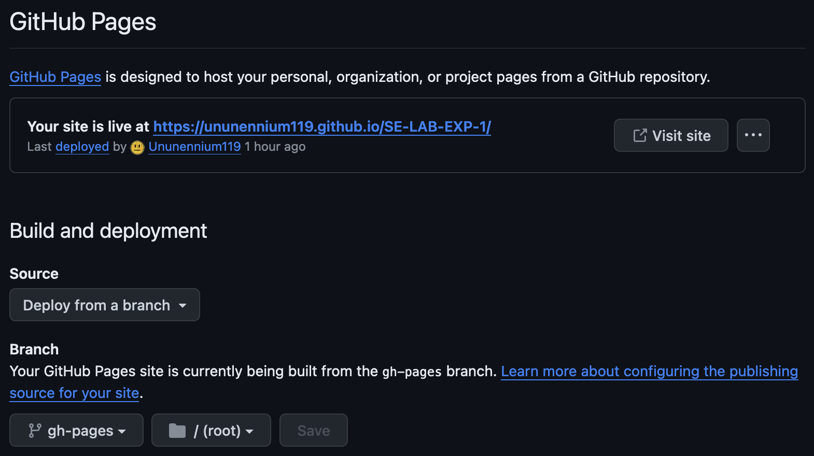

Then a new branch `ci/deploy-on-github-pages` was created and the `gh-pages` dependency was added to the project for deployment purposes. This dependency is used for deploying React applications to Github Pages.

```bash
npm install gh-pages --save-dev
```

After that, the [`main.yml`](./.github/workflows/main.yml) workflow was added which builds the application on the branch `gh-pages`. After the application is built, Github will deploy the application from `gh-pages` branch.

At last the branch was pushed to the remote repository, a pull request was created and the branch was merged into the `main` branch.

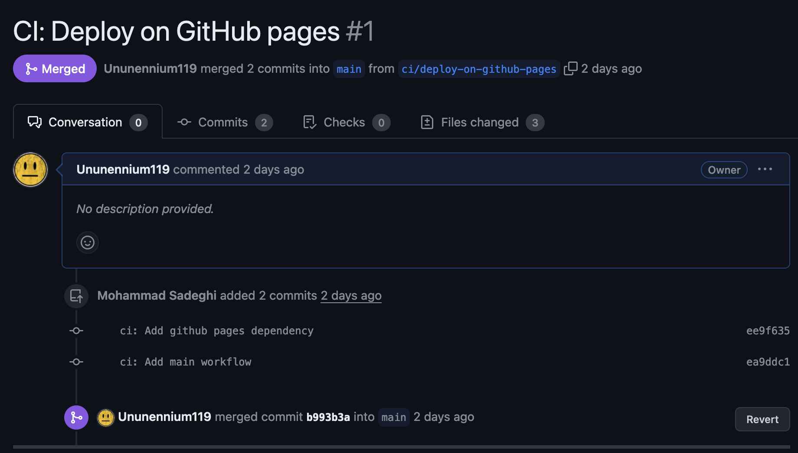

### Protecting The Main Branch

In `Settings/Rules/Rulesets` a rule was created for the `main` branch to only allow changes using pull requests.

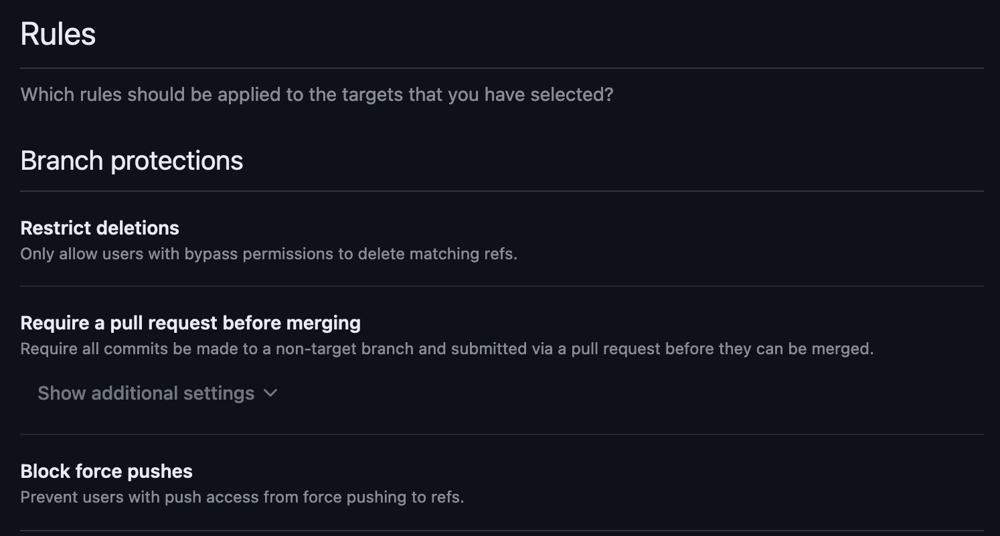

Also the `dev` branch was created and the [`enforcer.yml`](./.github/workflows/enforcer.yml) workflow was added to allow only merge requests from the `dev` branch to the `main` branch.

### Our Workflow

Initialy, serveral tasks were defined by the product manager.

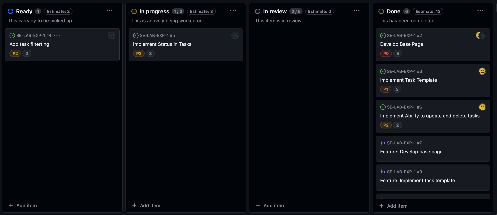

For each task a new branch was created and the required functionalities was implemented in the created branch. Then a pull request was created from the created branch to the `dev` branch. After reviewing the code and resolving conflicts if any, the created branch was merged into the `dev` branch.

Here is a list of some of the pull requests:

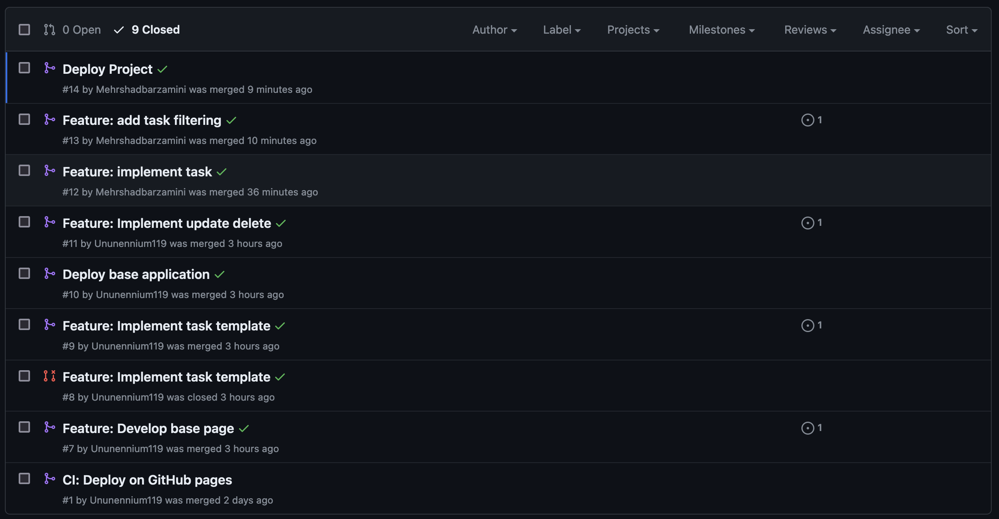

Also here is some of conflict which were resolved:

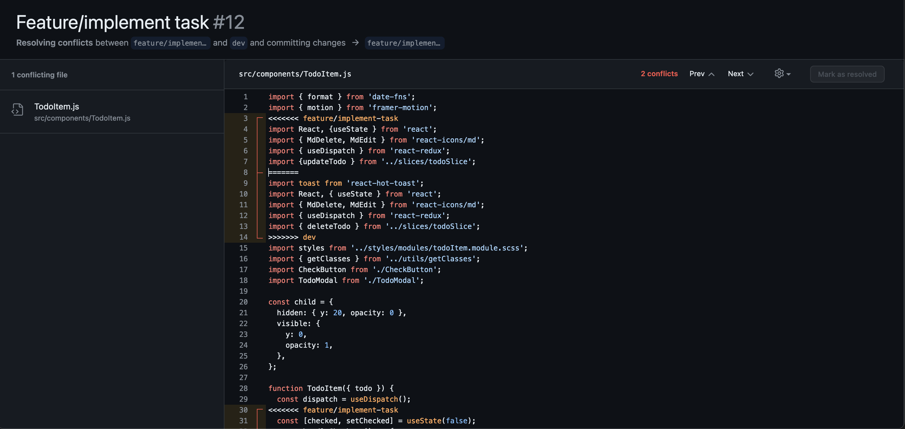
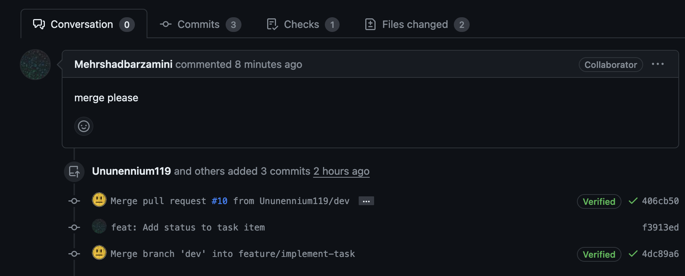

If we needed to deploy the application to Github Pages, we only needed to merge the `dev` branch into the `main` branch by creating a pull request.

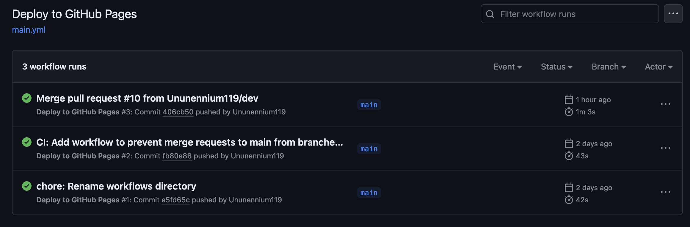
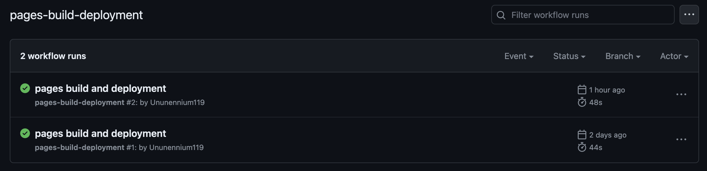

### Naming Conventions

#### Branch Names

`<type>/<short-description>`
- example: `feature/implement-task-template`

Here is a list of some of the branches:

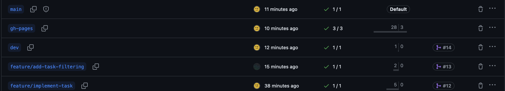

#### Commit Messages

`<type>: <description>`
- example: `feat: Add button component`

Here is a list of some of the commits:

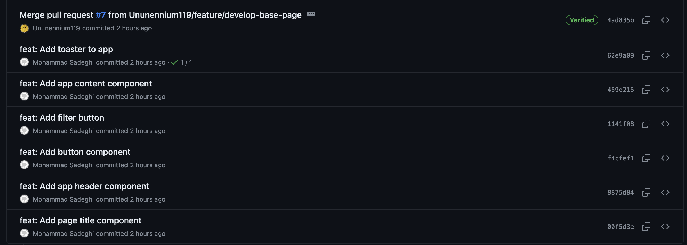

## Questions
